# Distant Reading, практика, часть I
Сегодня мы начнем говорить о том, какими методами и инструментами можно делать Distant Reading различных текстов.  

## Disclaimer
Результаты количественного анализа больших объемов текста **не всегда хорошо интерпретируемы**. Это может быть связано с:
* нашим недостаточным знанием материала
* плохим выбором того, "что считать"
* неудачно подобранным набором текстов
* отсутствием черной кошки в темной комнате... 🐈

В этой части мы исследуем методы учимся их применять. Если получается интересное -- это хорошо, но цель в освоении методов.

## Введение: а что мы вообще можем?
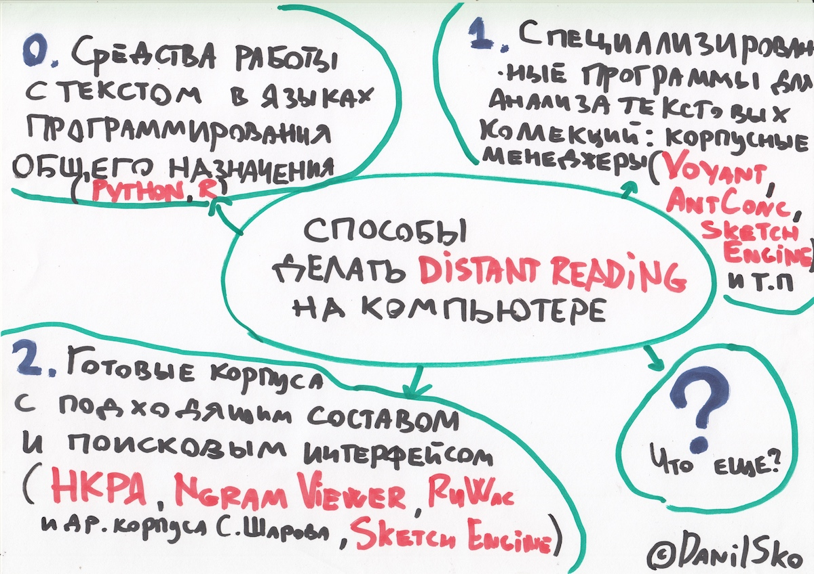

## Про способ № 2 (использование готовых корпусов) мы с вами уже немного поговорили, когда обсуждали Ngram Viewer

Вот еще примеры использования [НКРЯ](http://ruscorpora.ru) для distant reading'а:
* [Корпусный анализ русского стиха (видео Б.В. Орехова на постнауке)](https://postnauka.ru/video/85900 "Кликни и увидь")
* [Разные публикации Б.В. Орехова"](http://nevmenandr.net/bo.php), в которых есть слово "корпусный
* [A.A. Bonch-Osmolovskaya, Two Centuries of Russian Roads – Diachronic Study of Polysemy in the Context of Cultural Change](https://dh2016.adho.org/abstracts/413 "Кликни и прочти")
* [А.А. Бонч-Осмоловская, Корпусные наблюдения над портретами героев в "Войне и мире"](http://veeb.ut.ee/FLVE/ruslit/sobolev/1.pdf "Кликни и прочти")

## Теперь поговорим про способы № 1 (готовые корпусные менеджеры) и потом № 0 (на примере Python)

## Способ 1: корпусные менеджеры

### Voyant Tools

Вот [Voyant Tools](https://voyant-tools.org/) — популярный инструмент для входа в Digital Humanities. Простой, но имеет ограничения.

А вот **[наш с вами корпус фантастики](https://voyant-tools.org/?corpus=ad00c40ec4549bc30c185cf7f65c9318)**, загруженный в него. 

И вот еще несколько примеров поменьше: 
* [Главная страница Интерфакса за 3 месяца: январь-март 2014](https://voyant-tools.org/?corpus=8943e7b961f87daf226162f5a3f5e8da). 
* ["Война и мир" по томам](https://voyant-tools.org/?corpus=d6d851113e8787d79055aa1b434a37bd)
* [Преступление и наказание](https://voyant-tools.org/?corpus=7a14151684244d604e29fed45c15ddee)

### Полезный факт: Voyant Tools можно запускать и локально

Вам понадобится скачать Voyant Server [отсюда](http://docs.voyant-tools.org/resources/run-your-own/voyant-server/) (тут же есть все инструкции) и еще установить Java. После запуска VoyantServer.jar ваш компьютер запустит локальный сервер, который будет делать то же самое, что и онлайновый Voyant, но прямо на вашем компьютере. 

NB: Качать Voyant Server сейчас через вышкинскую сеть не надо, он тяжелый

## Частотности слов и конструкций, добавление/редактирование списка стоп-слов

Я уже лемматизировал наш корпус (подробнее об этом ниже). Поэтому вордклауд, который вам по умолчанию выдает Voyant в левом окошке, в нашем случае основан на частотностях лемм ☝️
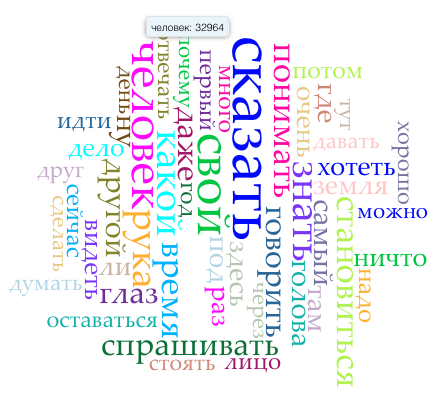
*почти 33 тыс. раз упоминаются люди и человеки в нашем корпусе фантастики!*

Через Scale можно выбрать показ облака для всего корпуса, или для отдельных документов. При помощи слайдера под облаком можно отрегулировать количество слов в облаке. 

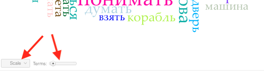

Сами частотности можно посмотреть во вкладке Terms (кнопка над облаком):

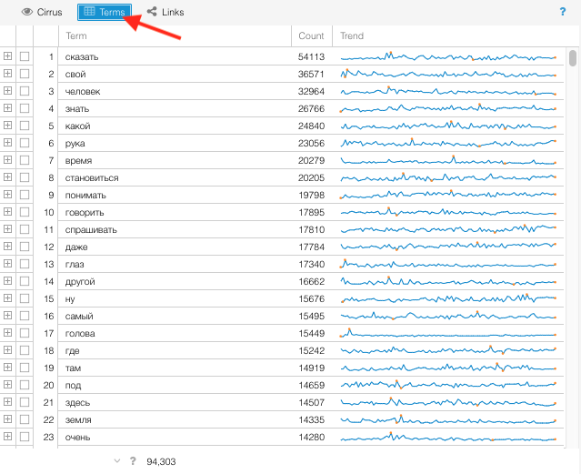
    
Как видите, тут довольно много служебных и околослужебных слов, которые нам неинтересны, вроде свой. А еще совсем недавно Voyant вообще не знал русских стоп-слов, и при первой загрузке получалось что-то такое:

К счастью, в Voyant есть функционал заливки списка стоп-слов. Можно вставить туда свой список:

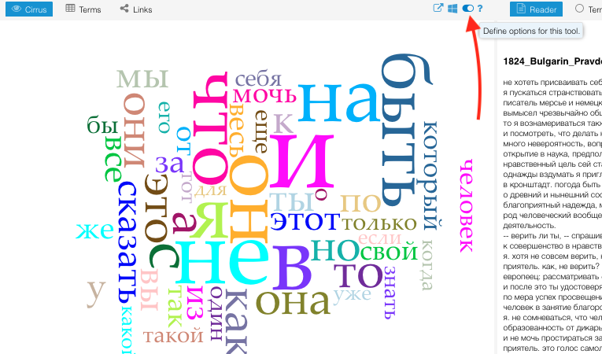
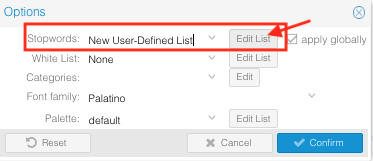

Вот мои [стоп-слова](stop_ru.txt), украденные откуда-то из интернета. После применения стоп-слов получается что-то такое: 

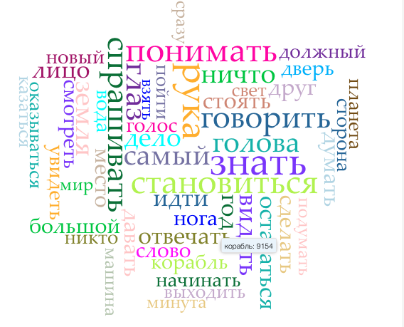
*Корабль? Машина? Это уже чуть-чуть интереснее!*

## Графики 📈

Voyant часто используют для построения графиков (а ля Google Ngram Viewer, но на вашем материале). Если ваш корпус имеет временн*у*ю протяженность, это бывает интересно. 

Ср. например, радио* (т.е. все слова, начинающиеся на "радио") и слово компьютер:
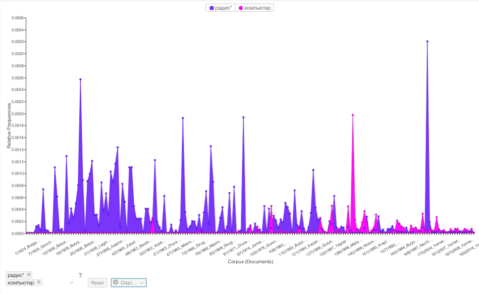

А вот пример из корпуса [Интерфакса за январь-март 2014](https://voyant-tools.org/?corpus=8943e7b961f87daf226162f5a3f5e8da) — слова "украина","олимпиада", "крым":

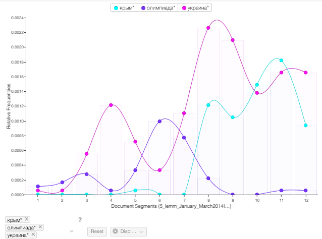

Показать пример из ["Войны и мира"](https://voyant-tools.org/?corpus=d6d851113e8787d79055aa1b434a37bd)

## Коллокации в Voyant
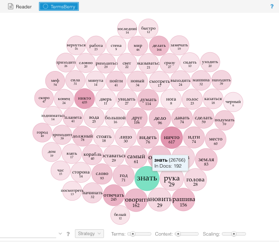

TermsBerry предоставляет такую же визуализацию частотных слов, что и Cirrus, но более полезна для исследования коллокатов: при наведении на слово подсвечиваются слова, которые встречаются рядом с выделенным. Определение “рядом”, то есть того, на каком расстояние слово должно находиться от выделенного чтобы считаться соседним, можно отрегулировать при помощи слайдера Context. Во вкладке Strategy можно переключиться между просто частотными словами, и “значимыми” словами - которые могут встречаться редко, но в определенных документах намного чаще, чем в других.

## Прочие окошки в Voyant 

### Reader
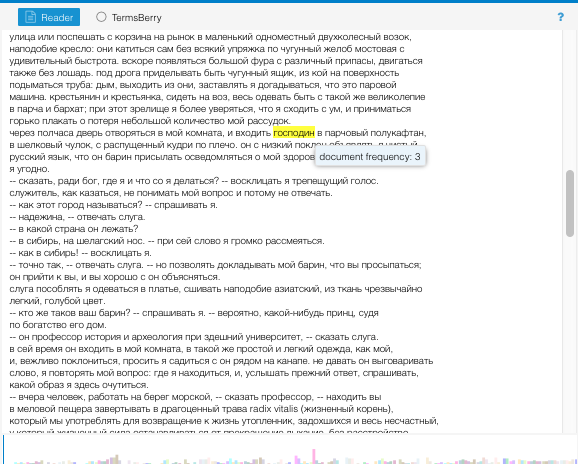

Панель Reader позволяет просматривать корпус как один непрерывный текст. Расположение читаемого текста относительно всего корпуса представлено внизу в виде разноцветных столбиков. Каждый столбик - это отдельный документ в корпусе. Его высота и ширина зависят от объема этого документа.
При наведении на слово можно посмотреть на его частоту в документе.

### Summary
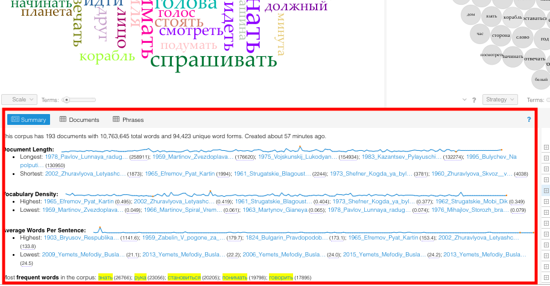
Панель Summary предлагает различную информацию и статистику о корпусе вообще и о некоторых документах: самые значимые слова для разных документов, количество слов в документе, среднюю длину предложений и т.д.
Также умеет выделять "наиболее специфические" слова данного корпуса. 

## Тематическое моделирование

Воянт умеет топик моделинг, можно посмотреть на примере ["Войны и мира"](https://voyant-tools.org/?corpus=d6d851113e8787d79055aa1b434a37bd)

## AntConc

[AntConc](http://www.laurenceanthony.net/software.html) — саперная лопатка мира корпусных менеджеров. Простая, но с ограниченными возможностями. Тем не менее там есть кое-что, чего нет в Voyant. Например:
* Более умные меры подсчета коллокаций
* Возможность загрузить словарь лемм, чтобы тексты лемматизировались прямо внутри программы
* Контрастивный анализ (выделение слов, которые характеризуют ваш корпус относительно какого-то референтного корпуса)

# Способ 0. Работаем в Питоне

### Как вы поняли, у всех готовых инструментов есть серьезные ограничения. 

Вы не можете запихнуть в AntConc или Voyant 1ГБ текста, не можете сделать внутри них всю нужную вам пред- или постобработку. 
А самое главное: **ВЫ ОСТАЕТЕСЬ ПОЛЬЗОВАТЕЛЕМ ПРОДУКТА**. А круто быть разработчиком, сам-себе-инженером, мастером.
Пока мы пользуемся каким-то продуктом, мы зависимы от него. Веб-приложение могут закрыть, программу перестанут поддерживать. 
И если что-то не работает, нам остается только грустить: ведь все спрятано под капотом.

### Поэтому мы стремимся к тому, чтобы реализовывать нужные нам вещи самостоятельно, программируя их.

Так мы гораздо меньше зависим от других, а если что-то сломалось, можем понимать, что и почему 
Если что-то не работает, мы можем придумать обход, сделать по-другому. 

Ну или найти решение на Stack Overflow (так решаются 95% проблем). 

Вот **[тут](https://github.com/dhhse/dhcourse/blob/master/dr_practice/first_dr_notebook_danya.ipynb)** лежит питоновская тетрадка, с которой мы поработаем.
По ссылке должно отображаться что-то такое: 
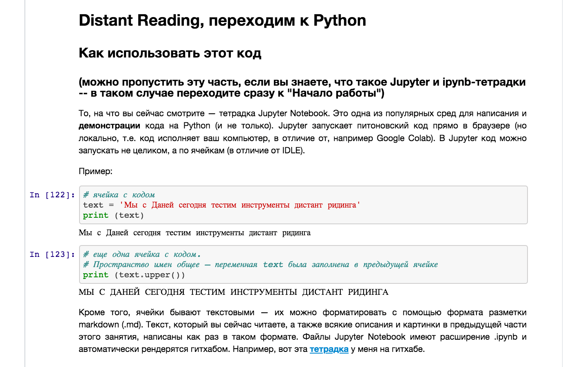
А если вдруг вместо этого ГитХаб говорит так:

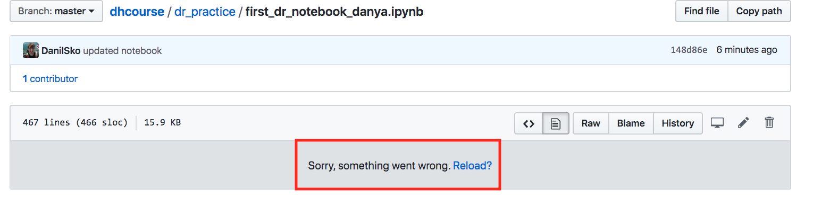
* (в последнее время на ГитХабе иногда что-то ломается с рендерингом ipynb) *

То посмотреть тетрадку можно [тут](https://nbviewer.jupyter.org/github/dhhse/dhcourse/blob/master/dr_practice/first_dr_notebook_danya.ipynb) 

(но для загрузки в Colab ссылка все равно понадобится гитхабная)