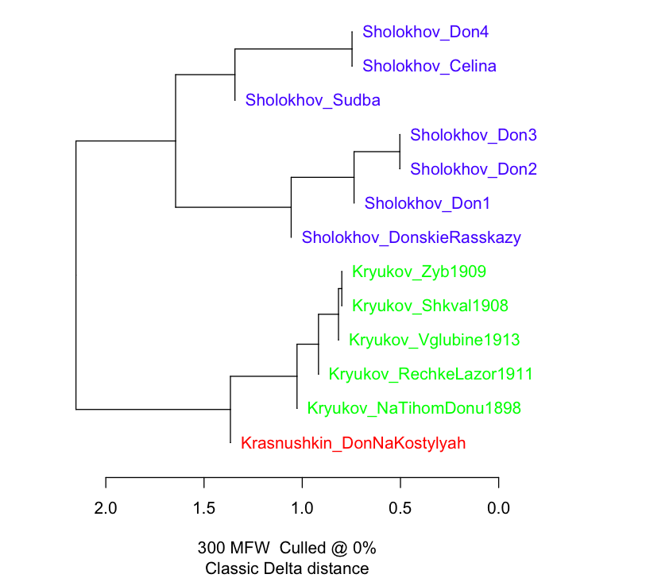

# Попрактикуемся в стилометрии, часть  2 (окончание)

Сегодня:

## 0. Напоминалка "в предыдущих сериях"

В прошлый раз мы в целом научились работать с функцией **stylo()** библиотеки stylo. 

Как вы помните, эта функция дает нам возможность измерить стилометрическую близость с разными параметрами. 

В частности, мы можем регулировать:

* число самых частотных элементов текста 

* тип этих элементов

* и некоторые другие параметры — см вкладку FEATURES в  интерфейсе Stylo. 

На основе измерения близости функция stylo() выдает разные варианты **кластеризации** — т.е. визуализирует, как группируются исследуемые тексты.
Например, с помощью дендрограммы (вариант **Cluster Analysis** во вкладке STATISTICS). 

*Дендрограмма*

Варианты MDS, PCA, tSNE -- это разные алгоритмы снижения размерности, которые пытаются в 2 измерениях отразить реальные стилометрические близости. Т.к. при сжатии неизбежно происходит большая потеря информации, они не очень надежны и используются редко.

Вариант **Bootstrap Consensus Tree** позволяет сделать кластеризацию-дендрограмму на базе сразу нескольких измерений с разными параметрами. 

А как же нам все-таки подбирать параметры? 

Если говоорить в терминах компьютерных наук, в функции stylo() методы Unsupervised Learning 