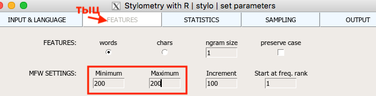
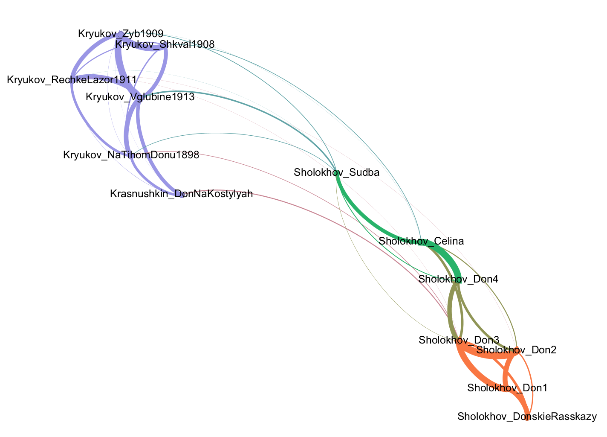

# Попрактикуемся в стилометрии, часть  2 (окончание)

Сегодня:

## 0. Напоминалка "в предыдущих сериях"

В прошлый раз мы в целом научились работать с функцией **stylo()** библиотеки stylo. 

Как вы помните, эта функция дает нам возможность измерить стилометрическую близость с разными параметрами. 

В частности, мы можем регулировать:

* число самых частотных элементов текста 

* тип этих элементов

* и некоторые другие параметры — см вкладку FEATURES в  интерфейсе Stylo. 

На основе измерения близости функция stylo() выдает разные варианты **кластеризации** — т.е. визуализирует, как группируются исследуемые тексты.
Например, с помощью дендрограммы (вариант **Cluster Analysis** во вкладке STATISTICS). 

*
Дендрограмма
*

Варианты MDS, PCA, tSNE -- это разные алгоритмы снижения размерности, которые пытаются в 2 измерениях отразить реальные стилометрические близости. Т.к. при сжатии неизбежно происходит большая потеря информации, они не очень надежны и используются редко.

Вариант **Bootstrap Consensus Tree** позволяет сделать кластеризацию-дендрограмму на базе сразу нескольких измерений с разными параметрами. 

Еще можно делать сети:

[Еще несколько живых примеров](https://slides.com/danilsko/stylometry_dh_ma#/8)

Все это — кластеризация. 

<!-- А что такое клстеризация? Если говоорить в терминах компьютерных наук, в функции stylo() методы Unsupervised Learning -->

А как же нам все-таки подбирать параметры? 

## 1. Функция сlassify() 

### тестирование определения авторства на основе Delta (и других мер стилистической близости)

### для классификации используются 

* Delta (в варианте, описанном в [Burrows 2002](https://doi.org/10.1093/llc/17.3.267) )
* стандартные алгоритмы анализа данных: 
	* машины опорных векторов (SVM)
	* метод К ближайших соседей
	* Наивный байесовский классификатор

### Те же параметры для классификации

* число самых частотных элементов текста 
* тип этих элементов

### Разные метрики близости
	
нужно два набора документов
1. обучающая выборка (primary_set)
2. тестовая (secondary_set) 

Давайте поделим наших [14 писателей](stylometry_texts/2_fourteen_russian_novels.zip) на две такие папки -- и запустим classify()

## 2. Функции rolling.delta() и rolling.classify() 

[Данные](stylometry_texts/rollingclassify.zip) 

У rolling.classify() интерфейса (GUI) вообще нет! 

Команда, вариант 1> rolling.classify(slice.size=5000, slice.overlap=4500, corpus.lang = "Other")

Команда, вариант 2> rolling.classify(slice.size=5000, slice.overlap=4500, corpus.lang = "Other", classification.method = "nsc")

NB: В stylo есть проблема с применением функций oppose () и rolling.delta/rolling.classify () **к текстам на кириллице**. Эта проблема, кажется, вообще нигде не описана, и её решение восходит к тайным знаниям самих разработчиков программы. Я решил на всякий случай поделиться, вдруг кому-то это спасет кусочек времени и нервов:

Проблема состоит в том, что при попытке применить указанные функции, stylo ругается, что тексты слишком короткие (This text is too short!), причем в консоли печатает из них только латиницу. При этом те же самые файлы отлично жуются базовой функцией stylo().

Причина в том, что в интерфейсе oppose ( ) забыли вкрутить указатель языка, а у rolling classify вообще пока нет интерфейса, где можно было бы указать язык. По умолчанию обе функции считают, что работаем с английским, и кириллицу игнорируют. Решение: при вызове функции прописывать в ней параметр языка, вот так: 
 
rolling.classify(write.png.file = TRUE, classification.method = "delta", mfw=1000,corpus.lang=“Other") 
oppose(corpus.lang=“Other”)

# 3. Oppose

[Данные](stylometry_texts/oppose.zip)