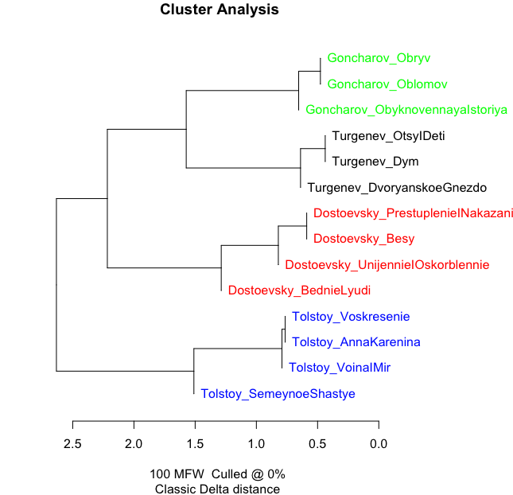
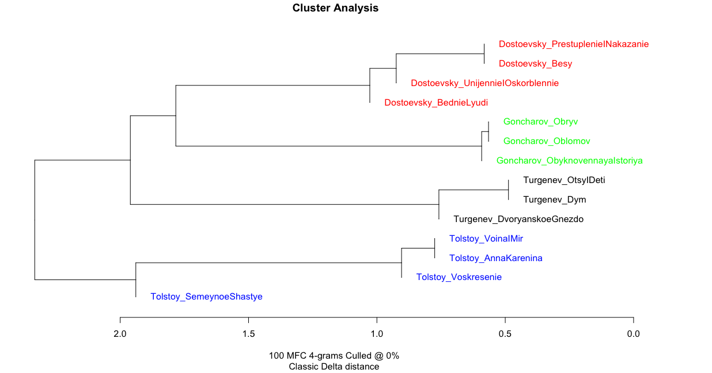
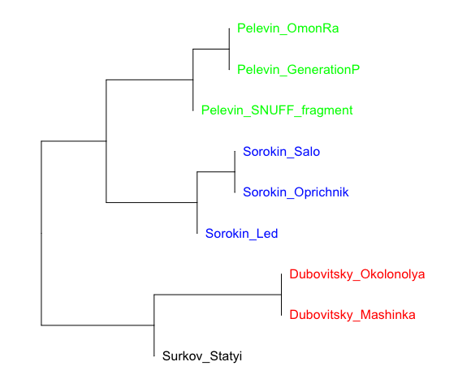

# Попрактикуемся в стилометрии

## 0. Лукьяненко versus Донцова (тестируем Stylo)

[Тексты](stylometry_texts/0_Лукьяненко%20Донцова.zip)

Получите такое (на настройках по умолчанию)

## 1. Пушкин, Лермонтов, Гоголь (тестируем Stylo)

[Тексты](stylometry_texts/1_pushkin_lermontov_gogol.zip)

### Получите такое (на настройках по умолчанию)

### Теперь попробуйте 200 MFW

Надо в интерфейсе Stylo пойти во вкладку FEATURES и выставить там минимум и максимум на 200.

Получите такое:

### Теперь попробуйте 300 MFW

Авторский сигнал устойчив!  

## 2. Достоевский, Толстой, Тургенев, Гончаров (тестируем Stylo)

[Тексты](stylometry_texts/2_fourteen_russian_novels.zip)

### Получите такое (на настройках по умолчанию) 

### Посмотрим на цифры, стоящие за визуализацией

Надо в интерфейсе Stylo пойти во вкладку OUTPUT и кликнуть там Save distance table.
Когда stylo отработает, в рабочей папке появится файл с названием вида "distance_table_[...]txt" 
По сути это CSV-таблица (вернее, DSV, потому что разделитель тут не запятая, а вовсе даже пробел.) 
Эту табличку можно открыть в любом табличном редакторе (в LibreOffice для этого достаточно поменять расширение файла на .csv; в Excel проще ничего не менять, а пойти в "Get data"/ "get external data"/ "получить данные" и там нажать From Text / из текста, а потом выбрать файл). 
Для наглядности табличку здорово раскрасить:

###  Изменится ли что-то при 300 MFW?

Авторский сигнал снова устойчив!

###  А как усреднить? Для этого есть Bootstrap Consensus Tree!

Надо в интерфейсе Stylo пойти во вкладку STATISTICS:

А потом выставить диапазон и шаг (Increment ) во вкладкe FEATURES:

#### Результат

### А если не на словах, а на символах? 

Вкладка FEATURES, поменять words на chars:

Так мы будем измерять частотности не слов. 

Авторский сигнал ВСЕ ЕЩЕ устойчив!

### В этом месте очень хочется попытаться осмыслить: ЧТО же мы все-таки измеряем таким образом?

"I think we should lock linguists and philologists in a room and not let them leave it until they explain what is happening" (Ян Рыбицкий на одном из стилометрических докладов во время конференции DH 2019 в Утрехте)

### Задание: сломайте этот тест!

Выставить такие Features, чтобы авторы кластеризовались с ошибкой (изменение языка с Other на English не считается, это слишком тупо).

# Окей, Даня, хватит тестов! Давай что-нибудь настоящее постилометрим!

## 3. Сурков и Дубовицкий (боевое применение  Stylo)

[Тексты -- по 2](stylometry_texts/3_surkov.zip)

[Тексты, расширенный набор](stylometry_texts/4_surkov_extended.zip)

## Знакомые с Gephi могут попытаться получить еще такую визуализацию стилометрической близости:

Менее знакомые, но чувствующие в себе силы могут воспользоваться [моей общей инструкцией](https://docs.google.com/document/d/1w3hWna5_BF60jxLf7Tn_sv6GyOCkYJ9ad4kQFU9mWLg/edit?usp=sharing) по визуализации CSV-таблицы с ребрами при помощи Gephi (вам будет не очень релевантна часть про размеры узлов)

### Задание: улучшить эксперимент с Сурковым

Это пока плохое доказательство, т.к. может вносить искажение разность жанров. Хорошо бы добавить еще парочку документов типа "сборник статей" (как Surkov_Statyi.txt), но принадлежащие НЕ суркову, а кому-то еще. Сделать пару таких и подмешать в корпус

## 4. Шолохов и компания (боевое применение  Stylo)

[Тексты: Шолохов, Крюков, Краснушкин](stylometry_texts/sholokhov_krasnuchkin_krykov.zip)

### Попробуйте 100 MFW

Попробуйте 200 MFW

Попробуйте 300 MFW

Попробуйте Bootstrap Consensus Tree 100 -- 300 с шагом 10

Сетевая визуализация тех же стилометрических близостей:

[Тексты: Шолохов, Крюков, Краснушкин + Серафимович, Платонов](stylometry_texts/sholokhov_krasnuchkin_krykov.zip)

## Расширенный эксперимент Шолохов++ — добавим Серафимовича и Платонова 

### пробуйте сами :)

...

А вот и полноценная научная статья о том, что думает Delta про авторство Шолохова: 
[Н.П. Великанова, Б.В. Орехов. Цифровая текстология: атрибуция текста на примере романа М.А. Шолохова «Тихий Дон»](http://nevmenandr.net/personalia/QuietDon.pdf)

## [Все тексты для практики, использованные выше (ссылка на папку)](stylometry_texts)
