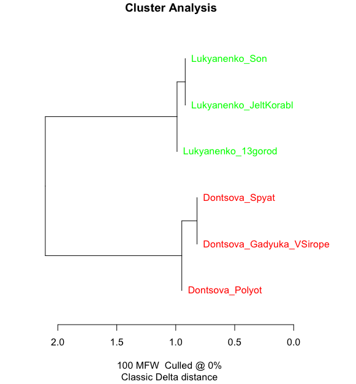

# Попрактикуемся в стилометрии

## 0. Лукьяненко versus Донцова (тест)

[Тексты](stylometry_texts/0_Лукьяненко%20Донцова.zip)

Получите такое 

## 1. Пушкин, Лермонтов, Гоголь (тест)

[Тексты](stylometry_texts/1_pushkin_lermontov_gogol.zip)

Попробуйте 100 MFW

Попробуйте 300 MFW

## 2. Достоевский, Толстой, Тургенев, Гончаров (тест)

[Тексты](stylometry_texts/2_fourteen_russian_novels.zip)

Попробуйте 100 MFW 

Попробуйте 500 MFW

Попробуйте Bootstrap Consensus Tree

## 3. Шолохов и компания (боевое применение)

[Тексты](stylometry_texts/3_sholokhov_and_others.zip)

Попробуйте 100 MFW

Попробуйте 500 MFW

Попробуйте Bootstrap Consensus Tree

[Все тексты для практики](stylometry_texts)