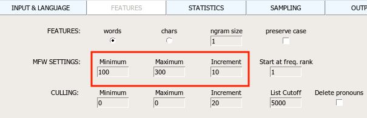

# Попрактикуемся в стилометрии

(на всякий случай: инструкция по установке stylo [тут](https://docs.google.com/document/d/1WyUeY6Qi7rlNRg73Bmo0FSPH3dwGjSxzS1SAi0D3uqw/edit?usp=sharing), по началу работы со stylo — [тут](https://docs.google.com/document/d/19vcol7KV80U4LnzpUVgi8DiTOmEUg6BOqp-vSddCUOo/edit?usp=sharing))

[Новый оф.сайт Stylo](https://computationalstylistics.github.io/)

[STYLO_HOWTO](https://docs.google.com/viewer?a=v&pid=sites&srcid=ZGVmYXVsdGRvbWFpbnxjb21wdXRhdGlvbmFsc3R5bGlzdGljc3xneDpmM2U3OGUzZTM2YjkyYzM)

## 0. Лукьяненко versus Донцова (тестируем Stylo)

[Тексты](stylometry_texts/0_Лукьяненко%20Донцова.zip)

Получите такое (на настройках по умолчанию)

## 1. Пушкин, Лермонтов, Гоголь (тестируем Stylo)

[Тексты](stylometry_texts/1_pushkin_lermontov_gogol.zip)

### Получите такое (на настройках по умолчанию)

### Теперь попробуйте 200 MFW

Надо в интерфейсе Stylo пойти во вкладку FEATURES и выставить там минимум и максимум на 200.

Получите такое:

### Теперь попробуйте 300 MFW

Авторский сигнал устойчив!  

## 2. Достоевский, Толстой, Тургенев, Гончаров (тестируем Stylo)

[Тексты](stylometry_texts/2_fourteen_russian_novels.zip)

### Получите такое (на настройках по умолчанию) 

### Посмотрим на цифры, стоящие за визуализацией

Надо в интерфейсе Stylo пойти во вкладку OUTPUT и кликнуть там Save distance table.
Когда stylo отработает, в рабочей папке появится файл с названием вида "distance_table_[...]txt" 
По сути это CSV-таблица (вернее, DSV, потому что разделитель тут не запятая, а вовсе даже пробел.) 
Эту табличку можно открыть в любом табличном редакторе (в LibreOffice для этого достаточно поменять расширение файла на .csv; в Excel проще ничего не менять, а пойти в "Get data"/ "get external data"/ "получить данные" и там нажать From Text / из текста, а потом выбрать файл). 
Для наглядности табличку здорово раскрасить:

###  Изменится ли что-то при 300 MFW?

Авторский сигнал снова устойчив!

###  А можно ли объединить в одном эксперименте — сразу несколько прогонов на разных настройках? Да!Для этого есть Bootstrap Consensus Tree!

Надо в интерфейсе Stylo пойти во вкладку STATISTICS:

А потом выставить диапазон и шаг (Increment) во вкладкe FEATURES:

#### Результат

### Как в качестве признаков использовать не целые слова, а цепочки символов (символьные n-gram'ы)? 

Вкладка FEATURES, поменять words на chars:

Так мы будем измерять частотности не слов. 

Авторский сигнал ВСЕ ЕЩЕ устойчив! 

Загляните в файл wordlist.txt и убедитесь, что теперь признаками для нас выступают не слова. 

### В этом месте очень хочется попытаться осмыслить: ЧТО же мы все-таки измеряем таким образом?

"I think we should lock linguists and philologists in a room and not let them leave it until they explain what is happening" (Ян Рыбицкий на одном из стилометрических докладов во время конференции DH 2019 в Утрехте)

### Задание: сломайте этот тест!

Выставить такие Features, чтобы авторы кластеризовались с ошибкой (изменение языка с Other на English не считается, это слишком тупо).

# Окей, Даня, хватит тестов! Давай что-нибудь настоящее постилометрим!

## 3. Шолохов и компания (боевое применение  Stylo)

[Тексты: Шолохов, Крюков, Краснушкин](stylometry_texts/sholokhov.zip)

### Попробуйте 100 MFW

Попробуйте 200 MFW

Попробуйте 300 MFW

Попробуйте Bootstrap Consensus Tree 100 -- 300 с шагом 10

Сетевая визуализация тех же стилометрических близостей:

[Тексты: Шолохов, Крюков, Краснушкин + Серафимович, Платонов](stylometry_texts/sholokhov_extended.zip)

## Расширенный эксперимент Шолохов++ — добавим Серафимовича и Платонова 

### пробуйте сами :)

...

А вот и полноценная научная статья о том, что думает Delta про авторство Шолохова: 
[Н.П. Великанова, Б.В. Орехов. Цифровая текстология: атрибуция текста на примере романа М.А. Шолохова «Тихий Дон»](http://nevmenandr.net/personalia/QuietDon.pdf)

## 4. Сурков и Дубовицкий (боевое применение  Stylo)

[Тексты -- по 2](stylometry_texts/3_surkov.zip)

[Тексты, расширенный набор](stylometry_texts/4_surkov_extended.zip)

## Знакомые с Gephi могут попытаться получить еще такую визуализацию стилометрической близости:

Менее знакомые, но чувствующие в себе силы могут воспользоваться [моей общей инструкцией](https://docs.google.com/document/d/1w3hWna5_BF60jxLf7Tn_sv6GyOCkYJ9ad4kQFU9mWLg/edit?usp=sharing) по визуализации CSV-таблицы с ребрами при помощи Gephi (вам будет не очень релевантна часть про размеры узлов)

Конечно, это пока плохое доказательство, т.к. может вносить искажение разность жанров. Хорошо бы добавить еще парочку документов типа "сборник статей" (как Surkov_Statyi.txt), но принадлежащие НЕ суркову, а кому-то еще. Сделать пару таких и подмешать в корпус

# Функция classify (): помогает протестировать результаты, визуализаций не делает

## Что мы поняли выше:

На основе измерения близости функция stylo() выдает разные варианты **кластеризации** — т.е. визуализирует, как группируются исследуемые тексты.
Например, с помощью дендрограммы (вариант **Cluster Analysis** во вкладке STATISTICS). 

*
Дендрограмма
*

Другеи варианты во вкладке STATISTICS —— MDS, PCA, tSNE -- это разные алгоритмы снижения размерности, которые пытаются в 2 измерениях отразить реальные стилометрические близости. Т.к. при сжатии неизбежно происходит большая потеря информации, они не очень надежны и используются редко.

Вариант **Bootstrap Consensus Tree** позволяет сделать кластеризацию-дендрограмму на базе сразу нескольких измерений с разными параметрами. 

Еще можно делать сети:

[Еще несколько живых примеров](https://slides.com/danilsko/stylometry_dh_ma#/8)

И все это — кластеризация. То есть мы просто как-то кучкуем наши тексты. Но ведь по сути перед нами скорее задача **классификации**! А как же нам все-таки подбирать параметры?

## C помощью функции сlassify() 

Что она делает? Смотрит на папку с обучающими данными (папка должна называться primary_set)  — и предсказывает авторство в другой папке, тестовой (secondary_set). То есть решает задачу классификации. Так можно померить качество определения авторства на основе Delta (и других мер стилистической близости)

### для классификации используются 

* Delta (в варианте, описанном в [Burrows 2002](https://doi.org/10.1093/llc/17.3.267) )
* стандартные алгоритмы анализа данных: 
	* машины опорных векторов (SVM)
	* метод К ближайших соседей
	* Наивный байесовский классификатор

### Те же параметры для классификации

* число самых частотных элементов текста 
* тип этих элементов

### Разные метрики близости
	
нужно два набора документов
1. обучающая выборка (primary_set)
2. тестовая (secondary_set) 

Демо: давайте поделим наших [14 писателей](stylometry_texts/2_fourteen_russian_novels.zip) на две такие папки -- и запустим classify()

# Функции rolling.delta() и rolling.classify() 

Умеют делать стилометрию в динамике. Хорошо для исследования соавторства над текстом. Разделение фрагментов, написанных разными авторами (либо более тонких влияний одного автора на другого).

[Данные](stylometry_texts/rollingclassify.zip) 

Как видите, тут тоже 2 папки. Их надо поло

## Сложность: отстутствие графич.интерфейса

У rolling.classify() интерфейса (GUI) вообще нет! Чтобы ей пользоваться, придется сначала через консоль R или RStudio пойти в нужную папку:

	>setwd ("путь к папке, где лежат две ваши папки — reference set и test set")

Дальше можно проверить, что вы в нужной папке: 
	> getwd() 

Поскольку интерфейса нет, придется вручную прописывать нужные параметры вручную и их передавать в фунцию. Прям как настоящие программисты, да. Например (сработает только после того, как вы задали нужную рабоч. папку через setwd):

Команда, вариант 1 :

	> rolling.classify(slice.size=5000, slice.overlap=4500, corpus.lang = "Other")

Команда, вариант 2
	> rolling.classify(slice.size=5000, slice.overlap=4500, corpus.lang = "Other", classification.method = "nsc")

NB: В stylo есть проблема с применением функций  rolling.delta/rolling.classify () и функции oppose () **к текстам на кириллице**. Эта проблема, кажется, вообще нигде не описана, и её решение восходит к тайным знаниям самих разработчиков программы. Я решил на всякий случай поделиться, вдруг кому-то это спасет кусочек времени и нервов:

Проблема состоит в том, что при попытке применить указанные функции, stylo ругается, что тексты слишком короткие (This text is too short!), причем в консоли печатает из них только латиницу. При этом те же самые файлы отлично жуются базовой функцией stylo().

Причина в том, что (в интерфейсе oppose ( ) забыли вкрутить указатель языка, а у rolling classify вообще пока нет интерфейса, где можно было бы указать язык. По умолчанию обе функции считают, что работаем с английским, и кириллицу игнорируют. Решение: при вызове функции прописывать в ней параметр языка, вот так: 
 
rolling.classify(write.png.file = TRUE, classification.method = "delta", mfw=1000,corpus.lang=“Other") 
oppose(corpus.lang=“Other”)

# Функция Oppose ()

Делает контрастивный анализ текстов. Тоже не имеет . Тоже надо прописывать

[Данные](stylometry_texts/oppose.zip)

## [Все тексты для практики, использованные выше (ссылка на папку)](stylometry_texts)
